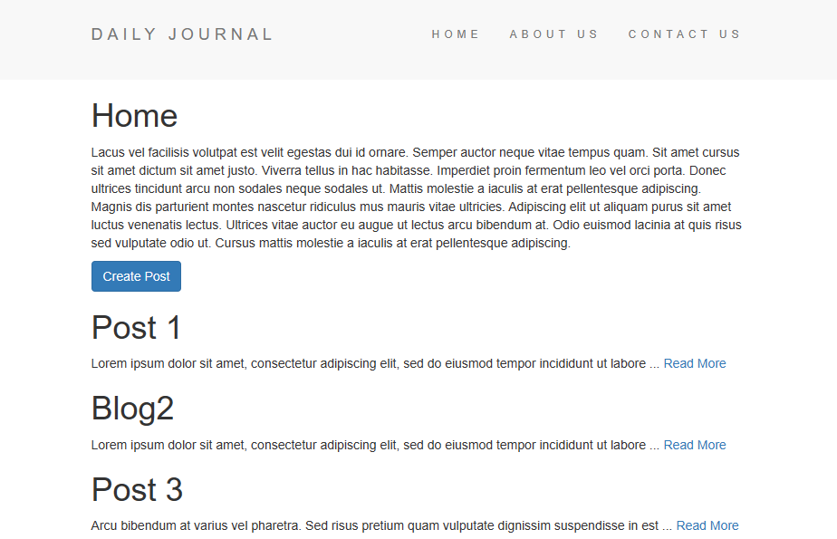
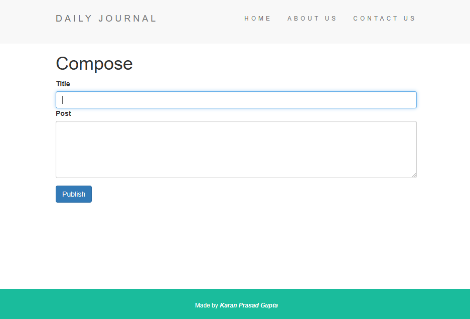

# WebBlog


WebBlog is a web application allowing users to create and publish their blogs. It provides a user-friendly interface for writing, viewing, and publishing blog posts. This repository contains the source code and resources for the WebBlog application.

## Table of Contents

- [Demo](#demo)
- [Features](#features)
- [Getting Started](#getting-started)
  - [Prerequisites](#prerequisites)
  - [Installation](#installation)
- [Technologies Used](#technologies-used)
  
## Demo
Check out the live demo of the WebBlog  Web-App: https://webog.onrender.com/




## Features
- **Blog Creation**: Users can create and customize their own blogs with a title and description.
- **Blog Management**: Users can also view a list of all their posts and navigate to individual posts for reading.

## Getting Started

To run the WebBlog application locally, please follow these steps:

### Prerequisites

- Node.js (version 10 or above)
- npm (Node Package Manager) or yarn

### Installation

1. Clone the repository:
   ```shell
   git clone https://github.com/karanprasadgupta/WebBlog.git
   ```
2. Change to the project directory:
  
   ```shell
   cd WebBlog
   ```
3. Install the dependencies:

   ```shell
   npm install
   ```
   or
   
    ```shell
   yarn install
   ```
4. Start the server:

   ```shell
   node app.js
   ```
   Open your web browser and visit http://localhost:3000 to access the WebBlog application.

## Technologies Used

The WebBlog application is built using the following technologies:

- **Frontend**: HTML, CSS, JavaScript, EJS
- **Backend**: Node.js, Express.js, Mongoose.js
- **Database**: MongoDB

> The WebBlog App was developed just for learning purposes.
Feel free to customize and enhance the App according to your needs. Happy blogging!!
